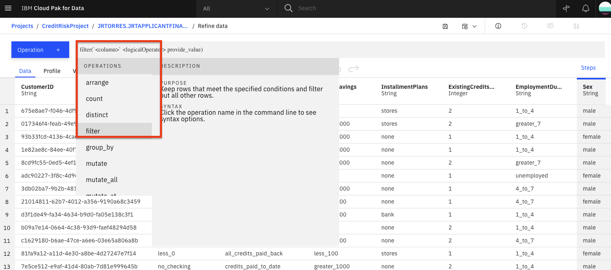
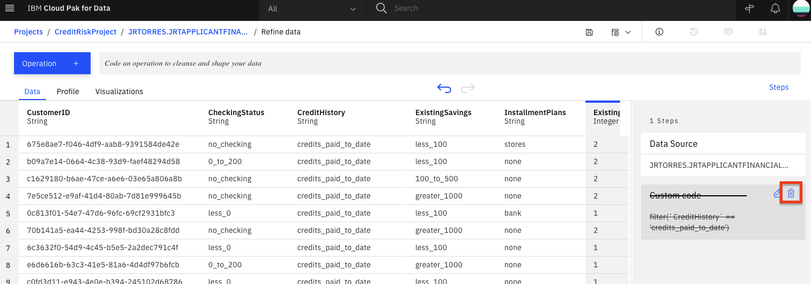
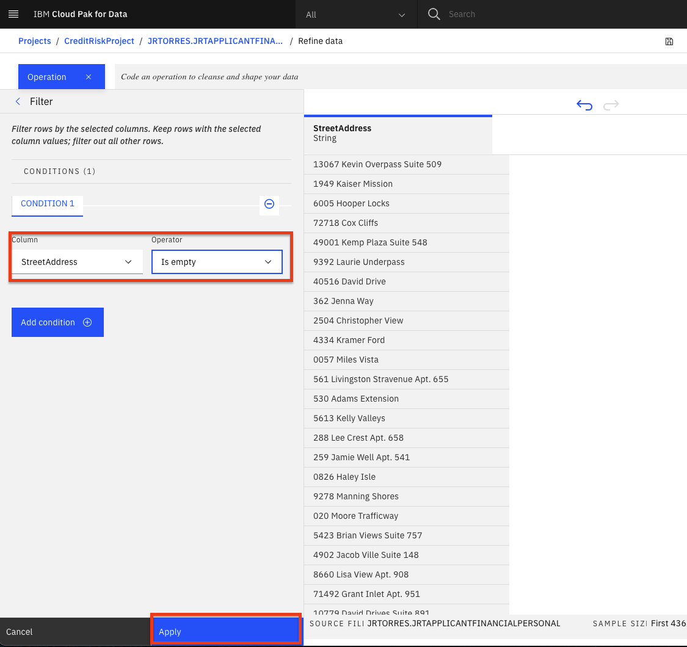
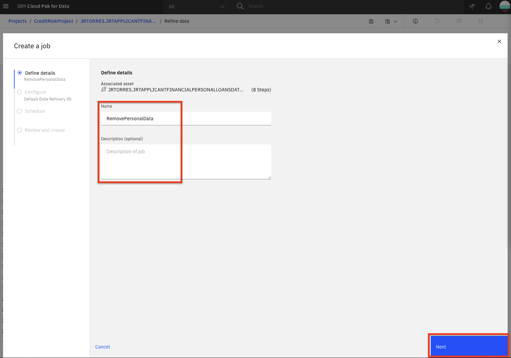
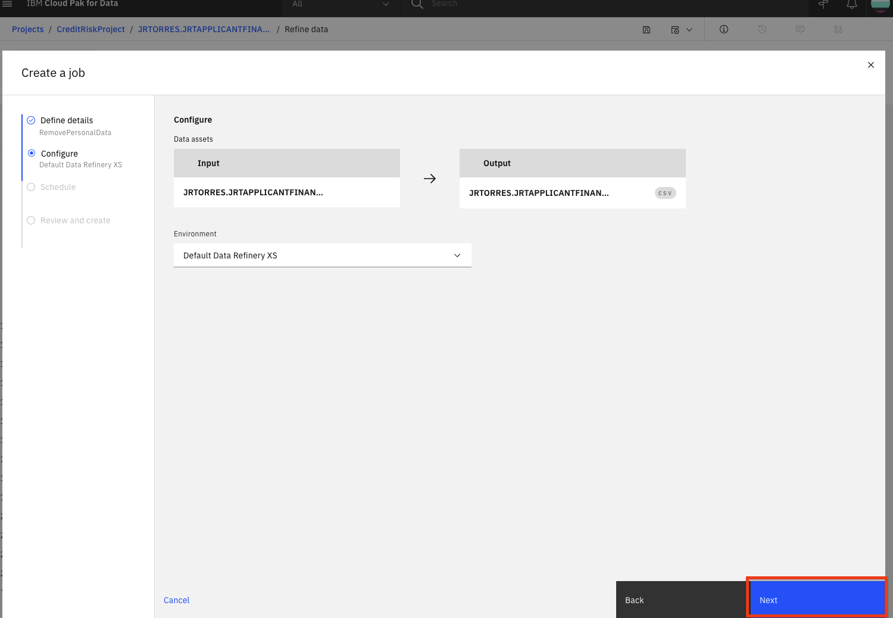
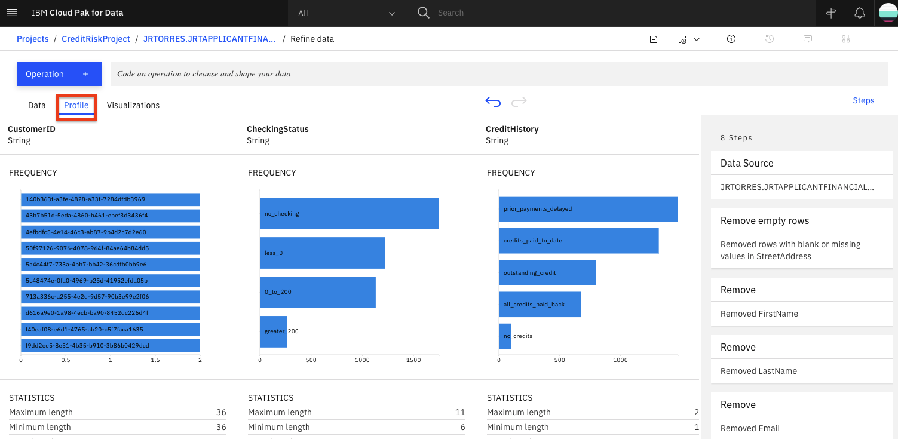
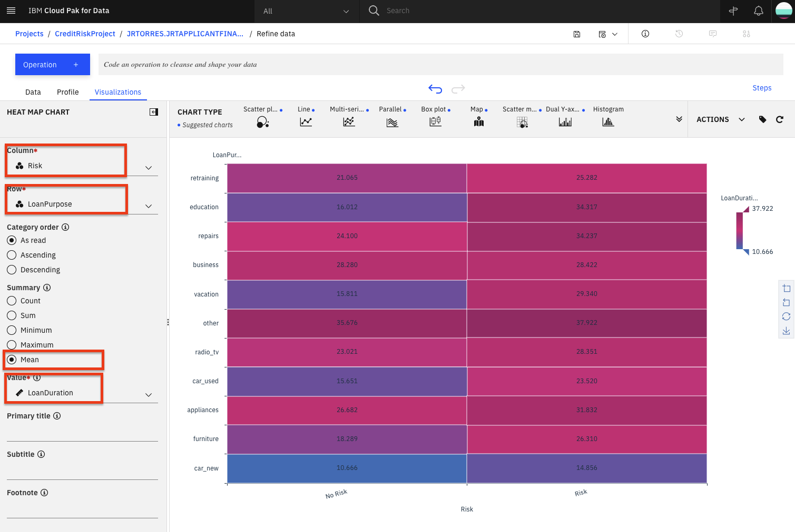
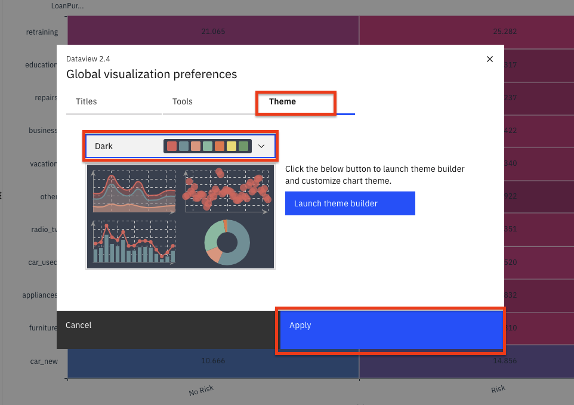

# Speed up your Data Cleansing with Data Refinery

## Workshop Resources

- [Login/Sign Up for IBM Cloud](https://ibm.biz/BdfpGB)
  
- [Hands-On Guide](https://developer.ibm.com/learningpaths/cloud-pak-for-data-learning-path/data-visualization-with-data-refinery/)

- [Slides]()

- [Workshop Replay](https://www.crowdcast.io/e/faster-data-cleaning)

## Table of Contents
1. [Prerequisites](#Prerequisites)
1. [Tutorial](#Tutorial )  
  
## Prerequisites
- Any prior experience with Data Processing would be advantageous. If you have no prior experience, read this blog as reference: https://towardsdatascience.com/data-analysis-using-excel-885f337c85c

## **Sign-up/Login to IBM Cloud**

If you are an existing user please [login to IBM Cloud](https://ibm.biz/BdfpGB)

And if you are not, don't worry! We have got you covered! There are 3 steps to create your account on [IBM Cloud](https://ibm.biz/BdfpGB):  
1- Put your email and password.  
2- You get a verification link with the registered email to verify your account.  
3- Fill the personal information fields.  
** Please make sure you select the country you are in when asked at any step of the registration process.
  

## Objective

Data Refinery is part of IBM Watson and comes with IBM Watson Studio on the public IBM Cloud and IBM Watson Knowledge Catalog running on-premises using IBM Cloud Pak for Data. It’s a self-service data-preparation client for data scientists, data engineers, and business analysts. With it, you can quickly transform large amounts of raw data into quality consumable information that’s ready for analytics. Data Refinery makes it easy to explore, prepare, and deliver data that people across your organization can trust.

## Architecture 
  
  Use the architecture on the IBM Developer - else edit it using the patterns 
  Link for architecture: https://l2fprod.github.io/myarchitecture/ 

## Tutorial 

### 1. Load Data
**Load the german_credit_data.csv data into Data Refinery**
- Download the [german_credit_data.csv](german_credit_data.csv) file to your local machine.  

- From the Project home, click on the Assets tab. Next, either drag and drop the downloaded [german_credit_data.csv](german_credit_data.csv) file to the right-hand side pane where it says Drop files here or browse for files to upload, or click on browse and choose the downloaded [german_credit_data.csv file](german_credit_data.csv).  

- Click on the newly added german_credit_data.csv file.

- You should be able to see the data as shown below. Click on **Refine**.

- Data Refinery will launch and open to the Data tab. It will also display the information panel with details of the data refinery flow and where the output of the flow will be placed. Go ahead and click the X to the right of the Information panel to close it.

### 2. Refine Data
We’ll start out in the Data tab where we wrangle, shape and refine our data. As you refine your data, IBM Data Refinery keeps track of the steps in your data flow. You can modify them and even select a step to return to a particular moment in your data’s transformation.

**Create Transformation Flow**
With Data Refinery, we can transform our data by directly entering operations in R syntax or interactively by selecting operations from the menu. For example, start typing filter on the Command line and observe that the list of operations displayed will get updated. Click on the filter operation.

- A filter operation syntax will be displayed in the Command line. Clicking on the operation name within the Command line will give hints on the syntax and how to use the command. For instance, to filter for customers who have paid credits up to date, build the expression shown below. To inact the filter, you would Apply the expression.

''' filter(`CreditHistory` == 'credits_paid_to_date') '''

- We can remove this custom filter by clicking on the trash icon on the Custom code step of our data workflow.

- We will use the UI to explore and transform the data. Click the +Operation button.

- Let’s use the Filter operation to check some values. Click on Filter in the left panel.

- We want to make sure that there are no empty values in the StreetAddress column. Select the StreetAddress column from the Column drop down list, select Is empty from the Operator drop down list, and then click the Apply button.

*Note: If there are records where the selected column is empty, they will be displayed after clicking the apply button. If there are no records for this filter, it means that the rows being sampled do not have any empty values for the selected column.*

- Now, click on the counter-clockwise “back” arrow to remove the filter. Alternately, we can also remove the filter by clicking the trash icon for the Filter step in the Steps panel on the right.

- We can remove these records with empty values. Click the +Operation again and this time select the Remove empty rows operation. Select the StreetAddress column, then click the Next button and finally the Apply button.

- Let’s say we’ve decide that there are columns that we don’t want to leave in our dataset ( maybe because they might not be usefule features in our Machine Learning model, or because we don’t want to make those data attributes accessible to others, or any other reason). We’ll remove the FirstName, LastName, Email, StreetAddress, City, State, PostalCode columns.

- For each columnn to be removed: Click the +Operation button, then select the Remove operation. Click the Change column selection option.

- In the Select column drop down, choose one of the columns to remove (i.e FirstName). Click the Next button and then the Apply button. The columns will be removed. Repeat for each of the above columns.

- At this point, you have a data transformation flow with 8 steps. As we saw in the last section, we keep track of each of the steps and we can even undo (or redo) an action using the circular arrows. To see the steps in the data flow that you have performed, click the Steps button. The operations that you have performed on the data will be shown.

- You can modify these steps in real time and save for future use.

**Schedule Jobs**
Data Refinery allows you to run jobs at scheduled times, and save the output. In this way, you can regularly refine new data as it is updated.

- Click on the “jobs” icon and then Save and create job option from the menu.

- Give the job a name and optional description, then click the Next button.

- The job will configure a default input and output data asset, as well as the runtime environment. Click the Next button.

- We can set the job to run on a schedule. For now, leave the schedule off and click the Next button.

- Click the Create and Run button to save and run this job.

- This refinery flow will be saved to your project in the Data Refinery flows section of the project overview page. From that section you could revisit the flow to edit the steps or even see any execution jobs you have run. For now, we will move on to exploring our data.

### 3. Profile Data
- Back on the top level of the data refinery view, click on the Profile tab to bring up a view of several statistics and histograms for the attributes in your data.

- Once the data profile loads, you can get insight into the data from the views and statistics:

- The median age of the applicants is 36, with the bulk under 49.

- About as many people had credits_paid_to_date as prior_payments_delayed. Few had no_credits.

- The median was 3 years for duration at current residence. Range was 1-6 years.

### 4. Visualize Data
Let’s do some visual exploration of our data using charts and graphs. Note that this is an exploratory phase and we’re looking for insights in out data. We can accomplish this in Data Refinery interactively without coding.

- Choose the Visualizations tab to bring up the page where you can select columns that you want to visualize. Select LoanAmount from the “Columns to visualize” drop down list as the first column and click Add another column to add another column. Next add LoanDuration and click the Visualize data button. The system will pick a suggested plot for you based on your data and show more suggested plot types at the top.

- Remember that we are most interested in knowing how these features impact a loan being at the risk. So, let’s add the Risk as a color on top of our current scatter plot. That should help us visually see if there’s something of interest here. From the left panel, click the Color Map drop down and select Risk. Also, to see the full data, drag the right side of the data selector at the bottom all the way to the right, in order to show all the data inside your plot.

- We notice that there are more blue (risk) on this plot towards the top right, than there is on the bottom left. This is a good start as it shows that there is probably a relationship between the riskiness of a loan and its duration and amount. It appears that the higher the amount and duration, the riskier the loan. Interesting, let’s dig in further in how the loan duration could play into the riskiness of a loan.

*Note: The colors used in your visualization may be different. Be sure to look at chart legend for clarification*

- Let’s plot a histogram of the LoanDuration to see if we can notice anything. First, select Histogram from the Chart Type.

- On the left, select LoanDuration for the ‘X-axis’, select Risk in the ‘Split By’ section, check the Stacked option, uncheck the Show kde curve toggle, uncheck the Show distribution curve toggle. You should see a chart that looks like the following image.

**Visualize loan duration**

- It looks like the longer the duration the larger the blue bar (risky loan count) become and the smaller the dark blue bars (non risky loan count) become. That indicate loans with longer duration are in general more likely to be risky. However, we need more information.

- We next explore if there is some insight in terms of the riskiness of a loan based on its duration when broken down by the loan purpose. To do so, let’s create a Heat Map plot.

- At the top of the page, in the Chart Type section, open the arrows on the right, select Heat Map.

- Next, select Risk in the column section and LoanPurpose for the Row section. Additionally, to see the effects of the loan duration, select Mean in the summary section, and select LoanDuration in the Value section.

- You can now see that the least risky loans are those taken out for purchasing a new car and they are on average 10 years long. To the left of that cell we see that loans taken out for the same purpose that average around 15 years for term length seem to be more risky. So one could conclude the longer the loan term is, the more likely it will be risky. In contrast, we can see that both risky and non-risky loans for the other category seem to have the same average term length, so one could conclude that there’s little, if any, relationship between loan length and its riskiness for the loans of type other.

- In general, for each row, the bigger the color difference between the right and left column, the more likely that loan duration plays a role for the riskiness of the loan category.

- Now let’s look into customizing our plot. Under the Actions panel, notice that you can perform tasks such as Start over, Download chart details, Download chart image, or set Global visualization preferences (Note: Hover over the icons to see the names). Click on the drop down arrow next to Action. Then click on the Global visualization preferences option from the menu.

We see that we can do things in the Global visualization preferences for Titles, Tools, Theme, and Notifications. Click on the Theme tab and update the color scheme to Dark. Then click the Apply button, now the colors for all of our charts will reflect this. Play around with various Themes and find one that you like.

## Sample Outputs

## Workshop Resources

- [Login/Sign Up for IBM Cloud](https://ibm.biz/BdfpGB)
  
- [Hands-On Guide](https://developer.ibm.com/learningpaths/cloud-pak-for-data-learning-path/data-visualization-with-data-refinery/)

- [Slides]()

- [Workshop Replay](https://www.crowdcast.io/e/faster-data-cleaning)

## Reference Links
  
## Done with the workshop? Here are some things you can try further

## Authors
